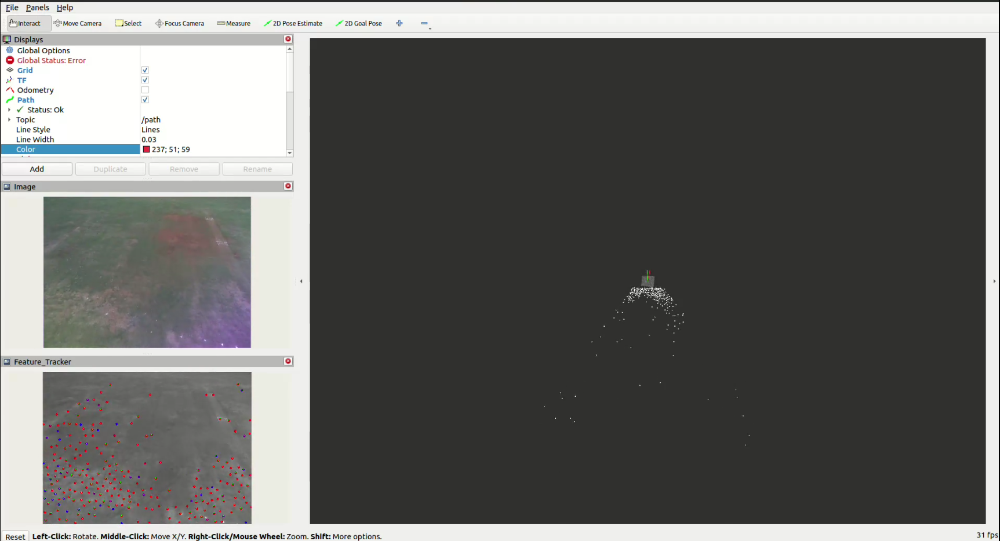

# VINS-Fusion

## VINS-Fusion with ROS2-Humble

### Prerequisites

- **System**
  - Ubuntu 22.04
  - ROS2 Humble

### Install Ceres-Solver with CUDA
#### Install dependencies

#### Remove opencv4.5 as it conflicts with 4.8 
```
sudo apt purge 'libopencv*'

```

``` 
sudo apt install -y \
  cmake \
  git \
  libgoogle-glog-dev \
  libgflags-dev \
  libatlas-base-dev \
  libsuitesparse-dev \
  libeigen3-dev

sudo apt install ros-humble-vision-opencv

```
#### Clone Ceres Solver

``` 
cd ~
git clone https://github.com/ceres-solver/ceres-solver.git
cd ceres-solver
git checkout 2.1.0   # recommended stable

```
### install Cv bridge

```
# Create a ROS 2 workspace if you don’t have one
mkdir -p ~/ros2_ws/src

cd ~/ros2_ws/src
git clone -b humble https://github.com/ros-perception/vision_opencv.git

cd ..
colcon build --symlink-install --cmake-args -DOpenCV_DIR=/usr/local/share/opencv4

echo -e '\nexport OpenCV_DIR=/usr/local/share/opencv4\nexport LD_LIBRARY_PATH=/usr/local/lib:$LD_LIBRARY_PATH' >> ~/.bashrc

echo 'source ~/ros_ws/install/setup.bash' >> ~/.bashrc

```

#### Configure with CUDA ENABLED

```
mkdir build && cd build

cmake .. \
  -DCMAKE_BUILD_TYPE=Release

make -j$(nproc)
sudo make install
sudo ldconfig

```

### Install Opencv with CUDA (Essential)
```
git clone https://github.com/opencv/opencv.git -b 4.8.0 --depth 1
git clone https://github.com/opencv/opencv_contrib.git -b 4.8.0 --depth 1

cd opencv

mkdir build/
cd build/

cmake -D CMAKE_BUILD_TYPE=RELEASE -D INSTALL_C_EXAMPLES=OFF -D INSTALL_PYTHON_EXAMPLES=OFF -D OPENCV_GENERATE_PKGCONFIG=ON -D BUILD_EXAMPLES=OFF -D OPENCV_ENABLE_NONFREE=ON -D WITH_IPP=OFF -D BUILD_TESTS=OFF -D BUILD_PERF_TESTS=OFF -D BUILD_opencv_adas=OFF -D BUILD_opencv_bgsegm=OFF -D BUILD_opencv_bioinspired=OFF -D BUILD_opencv_ccalib=OFF -D BUILD_opencv_datasets=ON -D BUILD_opencv_datasettools=OFF -D BUILD_opencv_face=OFF -D BUILD_opencv_latentsvm=OFF -D BUILD_opencv_line_descriptor=OFF -D BUILD_opencv_matlab=OFF -D BUILD_opencv_optflow=ON -D BUILD_opencv_reg=OFF -D BUILD_opencv_saliency=OFF -D BUILD_opencv_surface_matching=OFF -D BUILD_opencv_text=OFF -D BUILD_opencv_tracking=ON -D BUILD_opencv_xobjdetect=OFF -D BUILD_opencv_xphoto=OFF -D BUILD_opencv_stereo=OFF -D BUILD_opencv_hdf=OFF -D BUILD_opencv_cvv=OFF -D BUILD_opencv_fuzzy=OFF -D BUILD_opencv_dnn=OFF -D BUILD_opencv_dnn_objdetect=OFF -D BUILD_opencv_dnn_superres=OFF -D BUILD_opencv_dpm=OFF -D BUILD_opencv_quality=OFF -D BUILD_opencv_rapid=OFF -D BUILD_opencv_rgbd=OFF -D BUILD_opencv_sfm=OFF -D BUILD_opencv_shape=ON -D BUILD_opencv_stitching=OFF -D BUILD_opencv_structured_light=OFF -D BUILD_opencv_alphamat=OFF -D BUILD_opencv_aruco=OFF -D BUILD_opencv_phase_unwrapping=OFF -D BUILD_opencv_photo=OFF -D BUILD_opencv_gapi=OFF -D BUILD_opencv_video=ON -D BUILD_opencv_ml=OFF -D BUILD_opencv_python2=OFF -D WITH_GSTREAMER=OFF -D ENABLE_PRECOMPILED_HEADERS=OFF -D CMAKE_INSTALL_PREFIX=/usr/local -D OPENCV_EXTRA_MODULES_PATH=../../opencv_contrib/modules/ ../

make -j$(nproc)
sudo make install

```

### Install ROS2-Humble

https://github.com/Strroke21/V-SLAM-with-RTABMAP-and-Realsense-D4XX


### clone the repo

``` cd (your workspace)/src

git clone https://github.com/Strroke21/vins-fusion-with-ros2

cd vins-fusion-with-ros2

colcon build 

echo "source /opt/ros/humble/bin/ros2" >> ~/.bashrc
echo "source ~/vins-fusion-with-ros2/install/setup.bash" >> ~/.bashrc
source ~/.bashrc

```
### Run the Node (for dataset)

``` 
ros2 bag play (dataset folder) 
ros2 run vins vins_node (your config path)
ros2 launch vins vins_rviz.launch.xml

```
### for camera (realsense)

```
ros2 launch realsense2_camera rs_launch.py enable_infra1:=true enable_infra2:=true enable_color:=true enable_sync:=true rgb_camera.color_profile:=640,480,60 enable_sync:=true enable_gyro:=true enable_accel:=true unite_imu_method:=2 gyro_fps:=200 accel_fps:=200 depth_module.infra_profile:=640,480,60

ros2 run vins vins_node ~/vins-fusion-with-ros2/custom_config/rs_d455/rs_d455.yaml

ros2 run loop_fusion loop_fusion_node ~/vins-fusion-ros2/custom_config/rs_d455/rs_d455.yaml #optional for loop closure

rviz2 -d ~/vins-fusion-with-ros2/custom_config/vins_fusion.rviz

#optional for visualization

```

### for ardupilot 

``` 
python3 aero_vins.py #update in progress 

```
### Flight Test Video

[](https://drive.google.com/file/d/1Q1i9fy6b75TaGaKeJ7mhqQjBl9eKBurt/preview)